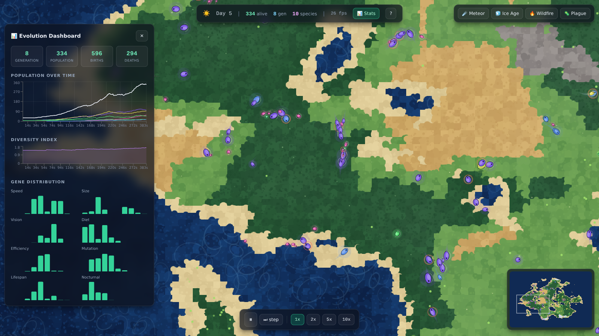

# 🌍 GENESIS — Living Ecosystem Simulator

**Watch evolution happen.** GENESIS is a browser-based ecosystem simulator where creatures with simulated DNA are born, eat, reproduce, mutate, and die in a procedurally generated world. There is no fitness function — the environment itself is the selector. Natural selection plays out in real time, and you can intervene as a god.

> 100% client-side. No backend, no APIs, no accounts. One command to run, one click to deploy.



---

## ✨ Features

- **Procedural world** — simplex-noise terrain with 11 biomes (ocean, river, shore, grassland, savanna, forest, jungle, swamp, desert, tundra, mountain) plus carved **rivers**, each with its own food rate, temperature and movement cost
- **Pixel-art creature families** — every species is assigned a recognizable archetype from its genes (wolf, bear, deer, rabbit, bird, owl, lizard, beetle, humanoid), drawn as hand-crafted, walk-animated pixel sprites colorized by the species' evolving hue
- **Human civilization** — when a humanoid species takes hold, the **Spark of Sapience** ignites and tribes rise *above* biology. They pool collective knowledge through communication, elders and "first-penguin" explorers, and climb the ages — **Stone → Fire → Tools → Agriculture → Faith → Writing** — visibly re-clothing their sprites at each era. Tribes build **campfires** (warmth at night + cooked food), **farms** (cultivated food), and **shrines** to a named **deity** they gather to worship. A Chronicle logs every milestone
- **Be their God** — they worship *you*. A **Divine Favor** meter per tribe rises when you feed or **bless** them (food-rain + healing) and falls when you **smite** them (a killing bolt) or let famine strike. Win their devotion and they raise **temples** in your name and gather to pray skyward; lose it and they make **sacrifices** to appease you
- **Sexes & sexual reproduction** — humanoids are male/female (subtle dimorphism) and need both sexes to breed
- **Versus Arena** — split the world with a **wall** (paint your own, leave gates) and pit two cohorts head-to-head with a live scoreboard: **Men vs Women**, **Smart vs Strong**, **Nocturnal vs Diurnal**, **Herbivores vs Carnivores** — or hand-place custom cohorts and watch them race
- **11 catastrophes** — meteor, ice age, wildfire, plague, drought, flood, earthquake, volcano, locusts, eclipse, and a bountiful bloom; fire them as a god or let them strike at random
- **Scenarios** — start from empty **Genesis**, a preloaded **Advanced Humans** world (tools, farms, temples already standing), or the **Versus Arena**
- **Bilingual** — fully translated, **Spanish by default** with a one-click English toggle (i18next, easy to extend)
- **Simulated DNA** — 10 genes per creature: speed, size, vision, color, diet spectrum, efficiency, reproduction threshold, mutation rate, lifespan, nocturnality
- **Real natural selection** — crossover + mutation on reproduction; the environment decides who survives
- **Speciation** — populations that drift genetically apart fork into visually distinct species, tracked on a phylogenetic timeline
- **Day/night cycle** — lighting shifts and nocturnal genes change creature behavior after dark
- **God Mode** — terraform biomes with a brush, drop food clusters, draw kill zones, spawn creatures
- **Genetic Lab** — design a genome with sliders, preview the phenotype live, release it into the world (presets: Speed Demon, Tank, Balanced, Nocturnal Hunter)
- **Catastrophic events** — meteor strike, ice age, wildfire, plague; the ecosystem crashes, adapts, rebuilds
- **Evolution Dashboard** — population per species, gene distribution histograms, diversity index, dominant species card, generation counter
- **Visual polish** — movement trails, walk cycles, biome particles (pollen, snow, embers, fireflies), water caustics, minimap with density overlay
- **Full mobile support** — one-finger pan, pinch zoom, tap to inspect, and every panel (God Mode, Lab, Dashboard) adapted to phone screens with touch-sized controls
- **Performance** — spatial hash grid, pre-baked terrain layer, sprite caching, off-screen culling, adaptive quality on mobile; smooth with 500+ creatures

## 🚀 Run locally

```bash
npm install
npm run dev      # → http://localhost:5173
```

```bash
npm run build    # production build in dist/
npm run preview  # serve the production build
```

## ☁️ Deploy

**Vercel** (zero config): import the repo at [vercel.com/new](https://vercel.com/new) — the included `vercel.json` and Vite preset handle everything.

**GitHub Pages**: `npm run build`, then publish the `dist/` folder (the build uses relative asset paths, so it works from any subpath):

```bash
npx gh-pages -d dist
```

## 🎮 Controls

| Input | Action |
| --- | --- |
| Drag / one finger | Pan the world |
| Scroll / pinch | Zoom |
| Click or tap creature | Inspect genome, energy, age, lineage |
| `Space` | Pause / play |
| `+` / `-` | Simulation speed (1x · 2x · 5x · 10x) |
| `.` | Step one tick |
| `G` | God Mode toolbar |
| `L` | Genetic Lab |
| `M` | Minimap |
| `D` | Evolution Dashboard |
| `C` | Civilization panel |
| `E` | Events panel |

## 🛠 Tech stack

- **Vite + TypeScript (strict)** — build & type safety
- **HTML5 Canvas 2D** — world rendering (terrain layer + entity layer)
- **React 18 + TailwindCSS** — glass-morphism UI overlay
- **Recharts** — dashboard charts
- **zustand** — engine → UI state bridge
- **i18next / react-i18next** — Spanish + English, dynamic and extensible
- Custom simplex noise, spatial hash grid, fixed-timestep game loop

## 🏗 Architecture

```
src/
├── engine/          # framework-free simulation core
│   ├── World.ts        # tile grid, biome generation, food, terraform, regrowth
│   ├── Genetics.ts     # genome, crossover, mutation, presets
│   ├── Sprites.ts      # pixel-art archetypes + per-era/per-sex humanoid sprites
│   ├── Culture.ts      # civilization: tribes, eras, fire, faith, divine favor, temples
│   ├── Creature.ts     # steering behaviors, energy model, lifecycle
│   ├── Species.ts      # online clustering → speciation tracking
│   ├── Events.ts       # meteor / ice age / wildfire / plague
│   ├── Simulation.ts   # fixed-timestep orchestrator + god-mode API
│   ├── Renderer.ts     # canvas layers, lighting, trails, effects
│   ├── Particles.ts    # ambient & event particle pools
│   ├── Camera.ts       # smooth pan/zoom
│   ├── SpatialGrid.ts  # O(1) neighbor queries
│   └── Stats.ts        # time series & histograms for the dashboard
├── ui/              # React overlay (HUD, panels, modals)
├── state/store.ts   # zustand bridge between engine and UI
└── utils/           # noise, math, color helpers
```

The simulation runs at a fixed 30 ticks/s decoupled from the render loop, so changing speed (up to 10x) never changes the physics. The React overlay receives a stats snapshot a few times per second; god-mode tools call directly into the engine singleton.

---

*Built with Claude Fable 5.*
